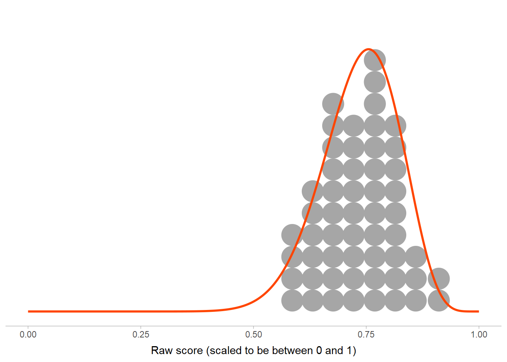
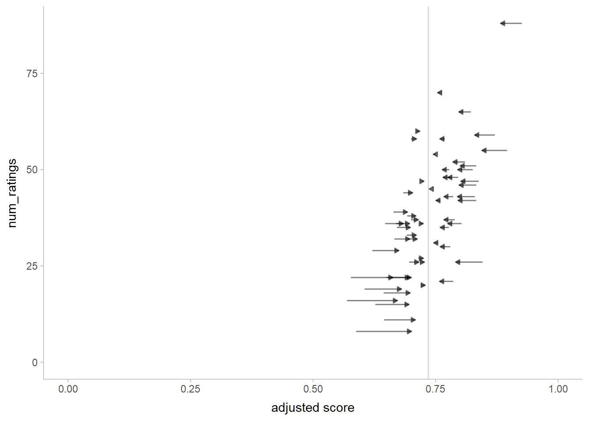
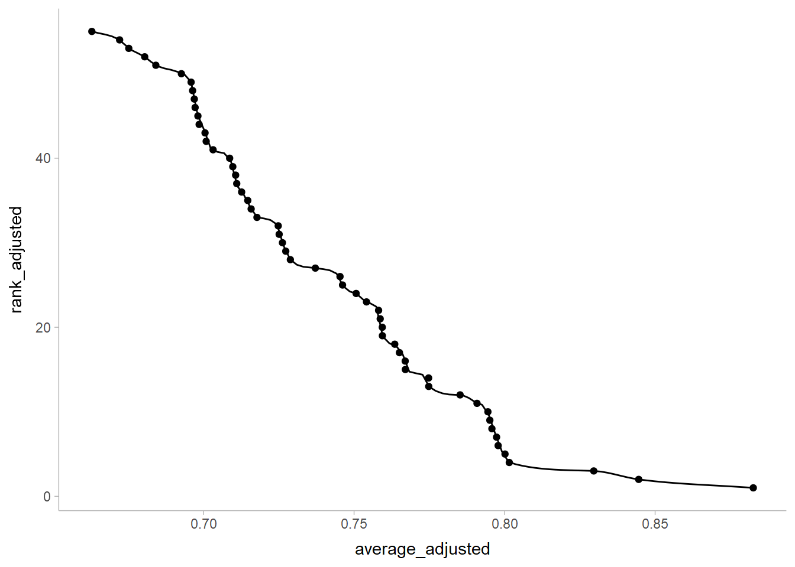
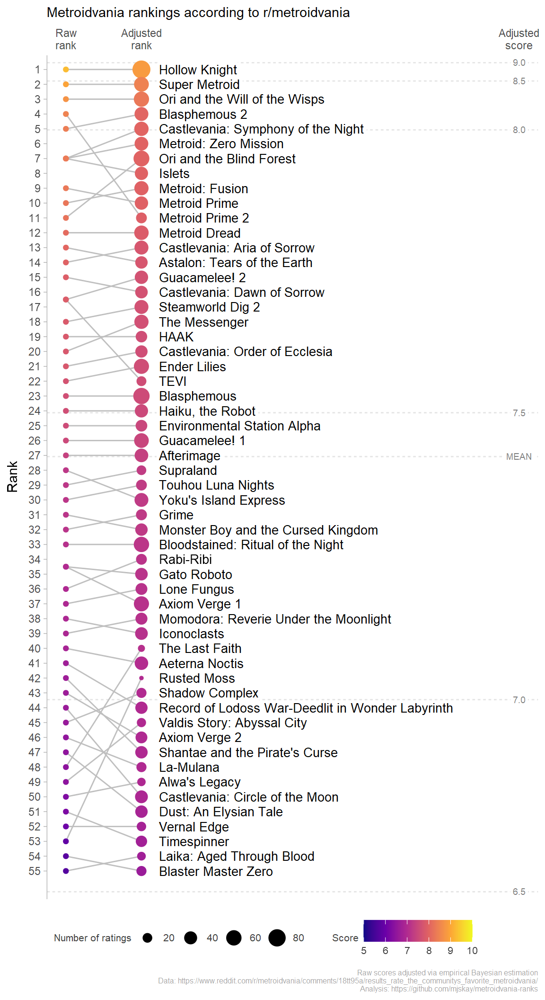

Metroidvania rankings
================

## Introduction

This document generates a visualization of rankings of Metroidvania
games according to data from [this post on
r/metroidvania](https://www.reddit.com/r/metroidvania/comments/18tt95a/results_rate_the_communitys_favorite_metroidvania/).
It corrects the scores of each game based on the number of people who
rated it using an empirical Bayes approach.

## Setup

Libraries we’ll need:

``` r
library(googlesheets4)
library(fitdistrplus)
library(distributional)
library(ggdist)
library(dplyr)
library(rlang)
library(janitor)
library(ggplot2)

theme_set(theme_ggdist())
```

Read in the data:

``` r
# use the commented-out line to read directly from Google Sheets
# df = googlesheets4::read_sheet("https://docs.google.com/spreadsheets/d/1k_6Ehj9rjS34ARqJScHqr-4r1EyMDULcTkbUV4eLr2U/edit#gid=2060671517") |>
df = readr::read_csv("ratings.csv") |>
  clean_names() |>
  mutate(average = average/10)
```

    ## New names:
    ## Rows: 55 Columns: 10
    ## ── Column specification
    ## ──────────────────────────────────────────────────────── Delimiter: "," chr
    ## (4): GAME, %Rated, % [10], ...9 dbl (5): Num.  Ratings, Average, B.Avg, StdDev,
    ## ...10 lgl (1): ...8
    ## ℹ Use `spec()` to retrieve the full column specification for this data. ℹ
    ## Specify the column types or set `show_col_types = FALSE` to quiet this message.
    ## • `` -> `...8`
    ## • `` -> `...9`
    ## • `` -> `...10`

## Adjusting scores

Let’s do empirical Bayes to adjust scores based on number of ratings.
First we need a prior for the average score based on the distribution of
raw averages, which will get by fitting a Beta distribution to the
average score (rescaled to be between 0 and 1):

``` r
grand_mean_params = fitdist(df$average, "beta")
grand_mean_params
```

    ## Fitting of the distribution ' beta ' by maximum likelihood 
    ## Parameters:
    ##         estimate Std. Error
    ## shape1 19.112474   3.648332
    ## shape2  6.868662   1.280729

The beta distribution fits the raw scores pretty well:

``` r
grand_mean_dist = inject(dist_beta(!!!grand_mean_params$estimate))

ggplot() +
  geom_dots(aes(x = average), data = df) +
  stat_slab(aes(xdist = grand_mean_dist), fill = NA, color = "orangered") +
  scale_y_continuous(breaks = NULL) +
  labs(
    y = NULL,
    x = "Raw score (scaled to be between 0 and 1)"
  ) +
  theme(axis.line.y = element_blank())
```



To do the adjustment, we consider each rating out of 1 as a fractional
“success”; i.e. a rating of 10/10 = 1 by one person is a full “success”,
a rating of 0/10 = 0 by one person a full “failure”, and anything else
is a fractional “success”. Thus, the existing mean rating on a 0-1 scale
can be multiplied by the number of ratings to get the number of
“success”es for each game.

To do the empirical Bayes correction, we use the beta distribution above
as a prior on the score of each game. We add the $alpha$ (`shape1`)
parameter to the successes and the $beta$ (`shape2`) parameter to the
failures, to get new $alpha$ and $beta$ parameters from which we can
calculate the adjusted average:

``` r
df_adjusted = df |>
  mutate(
    successes = average * num_ratings,
    failures = num_ratings - successes,
    alpha = successes + grand_mean_params$estimate[["shape1"]],
    beta = failures + grand_mean_params$estimate[["shape2"]],
    average_adjusted = alpha / (alpha + beta),
    rank = rank(-average),
    rank_adjusted = rank(-average_adjusted)
  )
```

And the adjusted scores are:

``` r
df_adjusted |>
  ggplot(aes(y = num_ratings)) +
  geom_vline(xintercept = mean(df$average), color = "gray85") +
  geom_segment(aes(x = average, xend = average_adjusted, yend = num_ratings), arrow = arrow(type = "closed", length = unit(4, "pt")), alpha = 0.5) +
  scale_x_continuous(limits = c(0, 1)) +
  scale_y_continuous(limits = c(0, NA)) +
  labs(x = "adjusted score")
```



Basically, scores further from the mean are pulled towards it, moreso if
they have fewer ratings. This is a conservative adjustment: if we know
less about a game (i.e. we have fewer ratings of it), we assume it is
closer to the average.

To annotate the plot with ranks and scores, we’ll also need a function
from score to approximate rank:

``` r
rank_from_average = with(df_adjusted, splinefun(average_adjusted, rank_adjusted, method = "monoH.FC"))

df_adjusted |>
  ggplot(aes(y = rank_adjusted, x = average_adjusted)) +
  stat_function(fun = rank_from_average) +
  geom_point()
```



Now we can put together a plot of original ranks/scores and adjusted
ranks/scores:

``` r
# reference points for scores
average_ref = tibble(
    average = seq(0.65, 0.9, by = 0.05),
    rank = rank_from_average(average),
    label = format(average * 10)
  ) |>
  bind_rows(tibble(
    average = mean(df_adjusted$average),
    rank = rank_from_average(average),
    label = "MEAN"
  ))

df_adjusted |>
  ggplot(aes(y = rank)) +
  geom_hline(aes(yintercept = rank), data = average_ref, color = "gray90", linetype = "22") +
  geom_label(aes(y = rank, label = label), data = average_ref, x = 7, hjust = 0.5, color = "gray50", size = 2.5, label.padding = unit(2, "pt"), label.size = 0) +
  geom_segment(aes(yend = rank_adjusted), x = 1, xend = 2, color = "gray75") +
  geom_point(aes(color = average * 10), x = 1) +
  geom_point(aes(y = rank_adjusted, size = num_ratings, color = average_adjusted * 10), x = 2) +
  geom_label(aes(label = game, y = rank_adjusted), x = 2.2, hjust = 0, size = 3.5, label.padding = unit(2, "pt"), label.size = 0) +
  scale_x_continuous(limits = c(1,7), breaks = c(1,2,7), labels = c("Raw\nrank", "Adjusted\nrank", "Adjusted\nscore"), position = "top", expand = expansion(add = 0.25)) + 
  scale_y_reverse(breaks = seq_len(nrow(df_adjusted)), expand = expansion(add = 0.5)) +
  scale_color_viridis_c(limits = c(5,10), option = "plasma") +
  labs(
    x = NULL,
    y = "Rank",
    color = "Score",
    size = "Number of ratings",
    subtitle = "Metroidvania rankings according to r/metroidvania",
    caption = "Raw scores adjusted via empirical Bayesian estimation\nData: https://www.reddit.com/r/metroidvania/comments/18tt95a/results_rate_the_communitys_favorite_metroidvania/\nAnalysis: https://github.com/mjskay/metroidvania-ranks"
  ) +
  theme(
    axis.line.x = element_blank(),
    axis.ticks.x = element_blank(),
    legend.text = element_text(size = 8, color = "gray25"),
    legend.title = element_text(size = 8, color = "gray25", vjust = 0.5),
    legend.title.align = 0,
    legend.box.just = "center",
    legend.position = "bottom",
    legend.justification = 0,
    plot.caption = element_text(size = 6, color = "gray65")
  )
```


